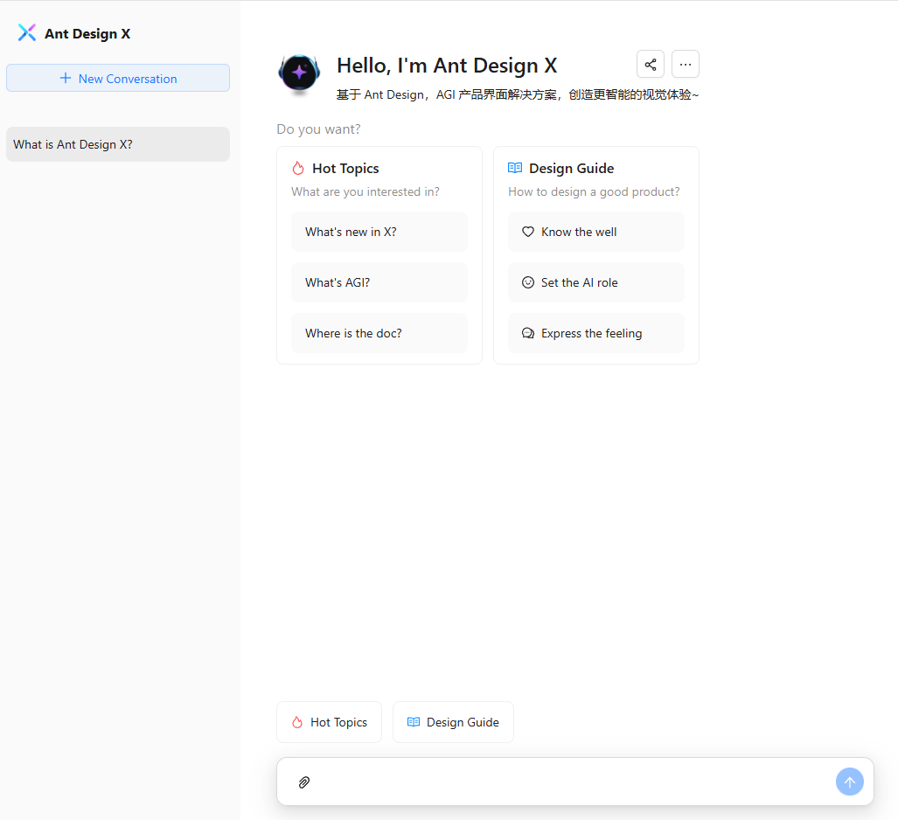

# AntX Chat UI

## Introduction

AntX Chat UI is a front-end chat interface built with **React**, **TypeScript**, **Vite**, and **Ant Design X**. It offers a sleek and intuitive user experience designed for AI-driven applications, with a particular focus on AGI (Artificial General Intelligence) solutions.

Key highlights include:

- **OpenAI Protocol for Communication**: The front end communicates with the back end using OpenAI’s protocol.
- **No Local Chat Logs**: All chat logs are stored on the back end. The front end does not store or cache any conversation data.

## Features

- **React** and **TypeScript** for a robust, maintainable codebase.
- **Vite** for lightning-fast development.
- **Ant Design X** integration for a modern, elegant interface.
- **Markdown** support for rich text rendering.
- Organized tabs for categorized conversations (e.g., *Hot Topics*, *Design Guide*).
- Smooth user interactions and enhanced UI responsiveness.

## Demo
[Demo](https://antx-chat-ui.vercel.app/)



## Getting Started

Follow the steps below to set up and run AntX Chat UI on your local machine.

### Prerequisites

Make sure you have the following installed:

- Node.js (v16 or higher)
- npm or yarn

### Installation

1. **Clone the repository:**

   ```bash
   git clone https://github.com/litongjava/antx-chat-ui.git
   cd antx-chat-ui
   ```

2. **Install the dependencies:**

   ```bash
   npm install
   ```
   Or
   ```bash
   yarn install
   ```

### Running the Project

To start the development server, run:

```bash
npm run dev
```

Or

```bash
yarn dev
```

The application will be accessible at [http://localhost:3000/](http://localhost:3000/).

### Building for Production

To build the project for production, use:

```bash
npm run build
```

Or

```bash
yarn build
```

The output files will be placed in the `dist` folder.

### Deploying

You can deploy the built project to any static hosting service such as Netlify, Vercel, or GitHub Pages.

## Project Structure

```
antx-chat-ui/
├── public/          # Static assets
├── src/
│   ├── components/  # Reusable components
│   ├── pages/       # Application pages
│   ├── styles/      # CSS/SCSS files
│   └── main.tsx     # Entry point
├── vite.config.ts   # Vite configuration
├── package.json     # Project metadata
└── README.md        # Project documentation
```

## Markdown Support

The chat interface supports Markdown syntax for rich text formatting. Users can write messages with Markdown, which will be rendered in the chat window.

### Supported Markdown Elements

- **Headings**
- **Bold and Italic Text**
- **Lists** (ordered and unordered)
- **Links**
- **Images**
- **Code Blocks**

## Communication Protocol

This project uses the **OpenAI** protocol to handle interactions between the front end and the back end. All chat requests and responses flow through this protocol, ensuring a consistent and secure data exchange for AI-driven features.

## Data Storage

To maintain user privacy and ensure optimal data consistency:

- **Front End**: Does **not** store any chat logs locally.
- **Back End**: Manages and stores all conversation history.

This approach ensures that user data remains safe and that any data manipulations or retrievals happen strictly on the server side.

## Customization

You can tailor the UI and functionality by updating the following:

- **src/components/**: Reusable UI components.
- **src/pages/**: Page-level components and layouts.
- **src/styles/**: Global styles, theming, and CSS/SCSS files.

## Contributing

Contributions are welcome! Feel free to open a pull request or file an issue to improve this project.

### Steps to Contribute

1. **Fork the repository**.
2. **Create a new branch**:
   ```bash
   git checkout -b feature/your-feature-name
   ```
3. **Make your changes and commit**:
   ```bash
   git commit -m "Add a meaningful commit message"
   ```
4. **Push to your branch**:
   ```bash
   git push origin feature/your-feature-name
   ```
5. **Open a pull request**.

## License

This project is licensed under the **MIT License**. Refer to the [LICENSE](./LICENSE) file for more details.

## Acknowledgments

- **Ant Design X**: A fantastic UI framework that elevates the project's design and user experience.
- The open-source community for providing valuable tools and support.

## Contact

For inquiries or feedback, please reach out via:

- **Email**: [litongjava001@gmail.com](mailto:litongjava001@gmail.com)
- **GitHub**: [Litong Java](https://github.com/litongjava)

---  

Feel free to adapt the content and structure as needed. Happy coding!
