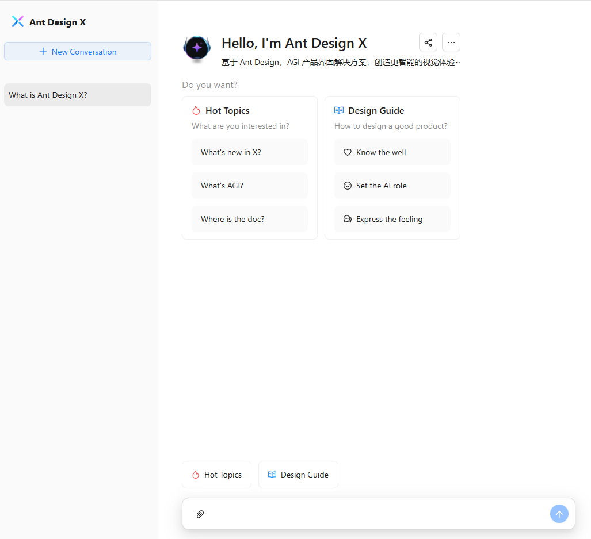

# AntX Chat UI

## 介绍

AntX Chat UI 是一个基于 **React**、**TypeScript**、**Vite** 和 **Ant Design X** 打造的前端聊天界面。它专为 AI 驱动的应用程序，尤其是 AGI（通用人工智能）解决方案而设计，提供了简洁直观的用户体验。

主要亮点包括：

- **OpenAI 协议进行通信**：前端通过 OpenAI 的协议与后端通信。
- **无本地聊天记录**：所有聊天记录都存储在后端，前端不存储或缓存任何对话数据。

## 功能特性

- **React** 和 **TypeScript**，构建健壮且可维护的代码基础。
- **Vite**，提供极速的开发体验。
- **Ant Design X** 的集成，为界面提供现代且优雅的外观。
- **Markdown** 支持，实现富文本渲染。
- 在不同的选项卡中分类对话（如 *热门话题*、*设计指南*）。
- 流畅的用户交互和优秀的界面响应速度。

## 体验地址
[体验地址](https://antx-chat-ui.vercel.app/)



## 快速开始

按照以下步骤在本地环境中设置并运行 AntX Chat UI。

### 先决条件

确保已安装：

- Node.js（版本 16 或更高）
- npm 或 yarn

### 安装

1. **克隆仓库：**

   ```bash
   git clone https://github.com/litongjava/antx-chat-ui.git
   cd antx-chat-ui
   ```

2. **安装依赖：**

   ```bash
   npm install
   ```
   或
   ```bash
   yarn install
   ```

### 启动项目

运行开发服务器：

```bash
npm run dev
```

或

```bash
yarn dev
```

然后在浏览器中访问 [http://localhost:3000/](http://localhost:3000/) 查看应用。

### 生产环境构建

要打包项目以便部署到生产环境，可执行：

```bash
npm run build
```

或

```bash
yarn build
```

打包后的文件将生成在 `dist` 文件夹内。

### 部署

可以将构建后的项目部署到任意静态托管服务，如 Netlify、Vercel 或 GitHub Pages。

## 项目结构

```
antx-chat-ui/
├── public/          # 静态资源
├── src/
│   ├── components/  # 可复用组件
│   ├── pages/       # 应用页面
│   ├── styles/      # CSS/SCSS 文件
│   └── main.tsx     # 入口文件
├── vite.config.ts   # Vite 配置
├── package.json     # 项目信息
└── README.md        # 项目文档
```

## Markdown 支持

该聊天界面支持 Markdown 语法，用于丰富文本格式。用户可以使用 Markdown 编写消息，并在聊天窗口中获得渲染的效果。

### 支持的 Markdown 元素

- **标题（Headings）**
- **加粗（Bold）和斜体（Italic）文本**
- **列表**（有序列表和无序列表）
- **链接**
- **图片**
- **代码块**

## 通信协议

该项目使用 **OpenAI** 协议来处理前端和后端之间的交互。所有聊天请求和响应均通过该协议进行，确保 AI 驱动功能的数据交换保持一致且安全。

## 数据存储

为保护用户隐私并确保数据一致性：

- **前端**：**不**在本地存储任何聊天记录。
- **后端**：负责管理和存储所有会话历史记录。

这种方式能保证用户数据的安全，同时也使得所有数据处理和检索仅在服务器端进行。

## 自定义

您可以通过修改以下内容来定制界面和功能：

- **src/components/**：可复用 UI 组件。
- **src/pages/**：页面级组件和布局。
- **src/styles/**：全局样式、主题以及 CSS/SCSS 文件。

## 参与贡献

欢迎贡献！如果想改进本项目，可以提交 pull request 或 issue。

### 贡献步骤

1. **Fork 仓库**。
2. **创建一个新分支**：
   ```bash
   git checkout -b feature/your-feature-name
   ```
3. **进行修改并提交**：
   ```bash
   git commit -m "Add a meaningful commit message"
   ```
4. **推送到你的分支**：
   ```bash
   git push origin feature/your-feature-name
   ```
5. **发起 pull request**。

## 许可证

本项目使用 **MIT License** 进行授权，详见 [LICENSE](./LICENSE) 文件。

## 致谢

- **Ant Design X**：极大提升本项目的设计与用户体验的优秀 UI 框架。
- 开源社区：提供了有价值的工具与支持。

## 联系方式

如有疑问或反馈，欢迎通过以下方式联系：

- **邮箱**: [litongjava001@gmail.com](mailto:litongjava001@gmail.com)
- **GitHub**: [Litong Java](https://github.com/litongjava)
